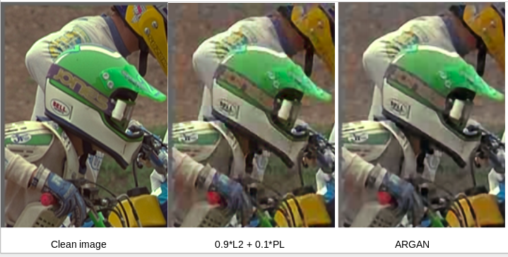

# Compression artifacts reduction
This repository contains the codes for different techniques for reducing JPEG compression artifacts in images

## ARGAN
* ARGAN folder contains the code which employs adversarial training for reducing compression artifacts. The generator network consists of a residual network with 5 residual blocks. 
* The discriminator network consists of 8 convolutional layers and 2 fully connected layers (no pooling layers).
* Some of the hacks articulated in [Gan hacks](https://github.com/soumith/ganhacks) have been used.
* The overall architecture has been inspired from [SRGAN paper](https://arxiv.org/abs/1609.04802)

## Baseline 
* baseline folder contains the code for several baseline experiments without using any adversarial training.
* We use a generator similar to the ARGAN folder (5 residual blocks), which aims to reduce the JPEG compression artifacts conditioned on the input compressed image.
* Variety of loss functions can be used; we report the model's performances on a) only L2 loss b) L2 + Total variation (TV) c) L2 + perceptual loss.
* Perceptual loss has inspired from this [paper](https://arxiv.org/abs/1609.04802), for we’ve used a pre-trained VGG
network and compared the activation of 4 th conv layer in the 5th block for the ground truth and the
reconstructed image.

## Dependencies
```
Python 2.7, Tensorflow 1.0.1
```
## Performance

The following are reported after 100000 iterations (which takes about 2 days when run on Nvidia GeForce GTX Titan X) and tested as average on 29 images of [LIVE1 dataset](http://live.ece.utexas.edu/research/quality/subjective.htm) 
* **ARGAN:** 
  Noisy PNSR = 28.06 dB | Reconstructed PNSR = 29.02 dB | Improvement = 0.96 dB
* **Baseline 1 (only L2 loss):**
  Noisy PSNR = 28.06 dB | Reconstructed PSNR = 28.82 dB | Improvement = 0.76 dB
* **Baseline 2 (L2  + TV):**
  Noisy PSNR = 28.06 dB | Reconstructed PSNR = 23.54 dB | Improvement = -4.52 dB  
* **Baseline 3 (L2 + perceptual loss):**
  Noisy PSNR = 28.06 dB | Reconstructed PSNR = 28.77 dB | Improvement = 0.71 dB 
* **Baseline 4 (0.9xL2 + 0.1xperceptual loss):**
  Noisy PSNR = 28.06 dB | Reconstructed PSNR = 28.83 dB | Improvement = 0.77 dB  
  
  


